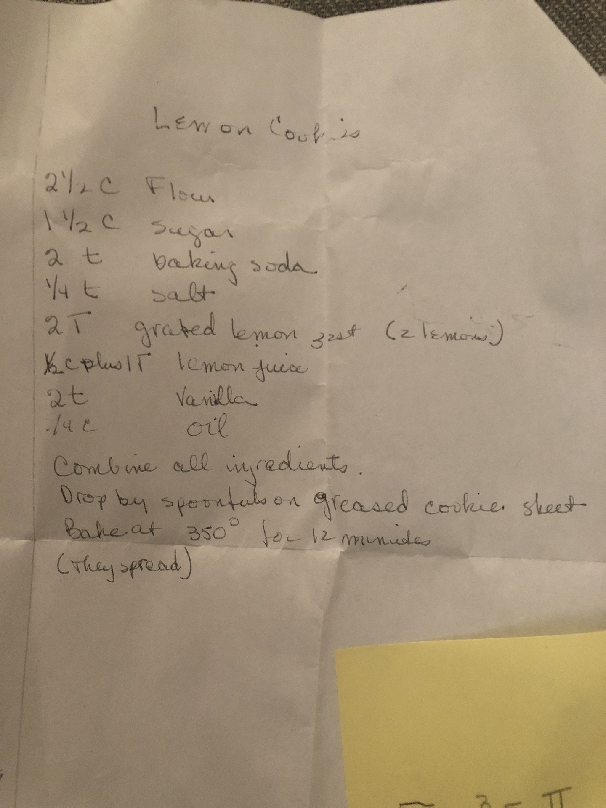

# Deborah Rubin's lemon cookies

## Ingredients

* 2.5 cups flour
* 1.5 cups sugar
* 2 teaspoons baking soda
* .25 teaspoons salt
* 2 tablespoons grated lemon zest (2 lemons)
* .5 cup plus 1 tablespoon lemon juice
* 2 teaspoons vanilla
* .25 cups oil

## Directions

1. Preheat oven to 350°F
2. Combine all ingredients
3. Drop by spoonful on greased cookie sheet, giving room to spread
4. Bake at 350° for 12 minutes
